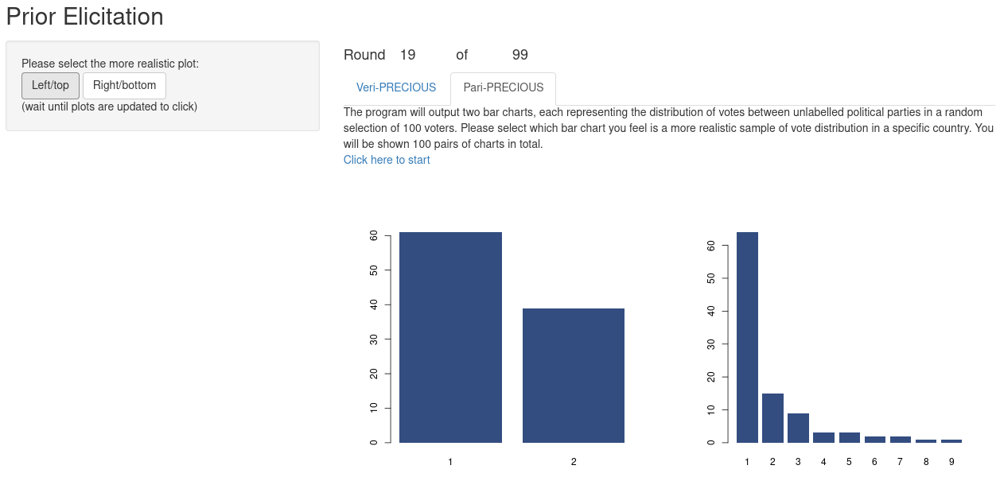

# Introduction

This is a web application for collecting data from content "specialists" in order to elicit prior distributions. It is written using [Shiny](https://shiny.rstudio.com/), [R](https://www.r-project.org/) and [Python](https://www.python.org/).



# Using

## Online version

Please visit the following URL to use the PriorElicitation app on your browser:

https://ocbe.shinyapps.io/elicit/

## Local hosting

You can also host the app on your computer, which is especially useful for developers. Run the following command from an interactive R session (you may have to run `install.packages("shiny")` before to install the Shiny R package):

```R
shiny::runGitHub("PriorElicitation", "ocbe-uio", "dev", "Shiny")
```

# Contributing

This is Open Source software and all contributions are welcome. If you would like to report a bug or request a feature, please open an issue on the [Issues page](https://github.com/ocbe-uio/PriorElicitation/issues).

# Citing

This project uses the [Citation File Format (CFF)](https://citation-file-format.github.io/), a human- and machine-readable format in YAML. Please refer to the citation metadata in [CITATION.cff](CITATION.cff).